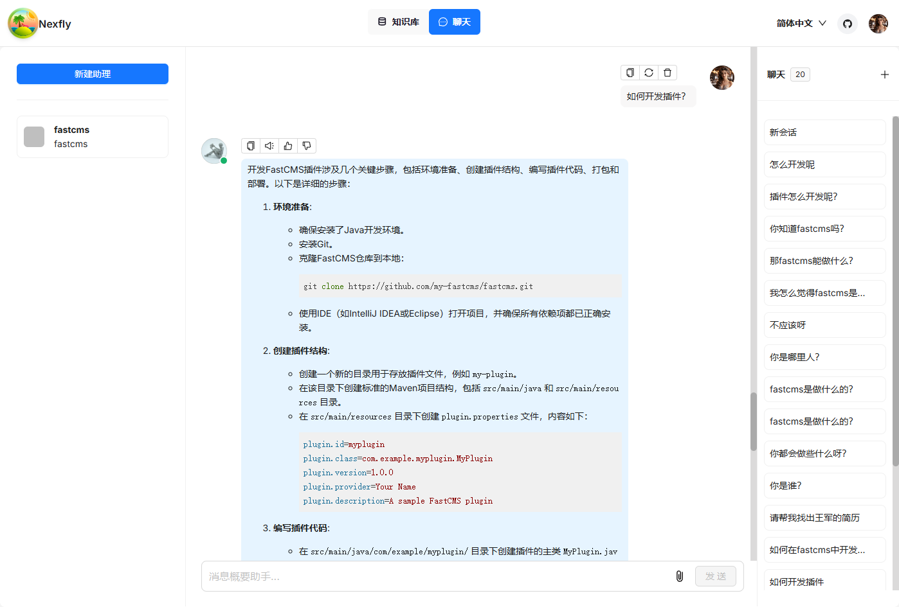

<div align="center">
<a href="http://nexfly.xjd2020.com/">

</a>
</div>

<p align="center">
  <a href="./README.md">简体中文</a> |
  <a href="./README.en.md">English</a> |
</p>

<p align="center">
    <a href="https://github.com/my-fastcms/nexfly/releases/latest">
        
    </a>
    <a href="http://nexfly.xjd2020.com/" target="_blank">
        </a>
    <a href="https://github.com/my-fastcms/nexfly/blob/main/LICENSE">
    
  </a>
</p>

## 💡 Nexfly 是什么？

[Nexfly](https://nexfly.cc/) 是一个深度整合spring-ai框架构建的开源 RAG（Retrieval-Augmented Generation）应用项目。

## 🎮 在线试用

试用请登录网址 [http://nexfly.xjd2020.com](http://nexfly.xjd2020.com)。
<div align="center" style="margin-top:20px;margin-bottom:20px;">

</div>

## 🌟 功能介绍

### 🍭 **无缝集成**

- 能快速接入第三方业务系统，让已有业务系统快速接入ai能力。
- 通过整合Spring security框架，快速打通微信、Google等遵循oath2规范的第三方系统账号对接。

### 🍱 **深度文档解析**

- 通过深度整合spring-ai，Tesseract OCR等技术框架，对文档进行ocr视觉识别解析，达到文档分割的精准度。
- 支持多种非结构化数据的处理能力，包括pdf，doc，ppt等

### 🛀 **灵活的RAG流程配置**

- 全面优化的 RAG 工作流可以支持超大型企业的各类生态系统。
- 大语言模型 LLM 以及向量模型均支持配置。

## 🎬 快速开始

### 📝 前提条件

- CPU >= 4 核
- RAM >= 16 GB
- Docker >= 24.0.0 & Docker Compose >= v2.26.1
  > 如果你并没有在本机安装 Docker（Windows、Mac，或者 Linux）, 可以参考文档 [Install Docker Engine](https://docs.docker.com/engine/install/) 自行安装。

### 🚀 启动服务器

1. 克隆仓库：

   ```bash
   $ git clone https://github.com/my-fastcms/nexfly.git
   或者
   $ git clone https://gitee.com/xjd2020/nexfly.git
   ```

2. 进入 **docker** 文件夹，利用提前编译好的 Docker 镜像启动服务器：

   ```bash
   $ cd nexfly/docker
   $ docker compose up -d
   ```

   > 如果你想下载并运行特定版本的 docker 镜像，请在 docker/.env 文件中找到 NEXFLY_VERSION 变量，将其改为对应版本。

   > 第一次构建拉取Nexfly镜像以及中间件镜像可能需要一定时间，请耐心等待。

3. 服务器启动成功后再次确认服务器状态：

   ```bash
   $ docker logs -f nexfly-system
   $ docker logs -f nexfly-auth
   $ docker logs -f nexfly-gateway
   ```

   _出现以下界面提示说明服务器启动成功：_

   ```bash

    Connected to the target VM, address: '127.0.0.1:65520', transport: 'socket'
      _   _                 ______   _
    | \ | |               |  ____| | |             Nexfly:v0.0.1-SNAPSHOT
    |  \| |   ___  __  __ | |__    | |  _   _      Pid: 27128
    | . ` |  / _ \ \ \/ / |  __|   | | | | | |
    | |\  | |  __/  >  <  | |      | | | |_| |
    |_| \_|  \___| /_/\_\ |_|      |_|  \__, |
                                        __/ |
                                        |___/
   
   ```

4. 在浏览器中输入你的服务器对应的 IP 地址并登录 Nexfly。
   > 上面这个例子中，您只需输入 http://127.0.0.1 即可：未改动过配置则无需输入端口（默认的 HTTP 服务端口 80）。

## 🔧 系统配置

系统配置涉及以下文件：

- [.env](./docker/.env)：存放一些基本的系统环境变量，比如 `MYSQL_PASSWORD`、`MINIO_PASSWORD`、Nginx端口等。
- [docker-compose.yml](./docker/docker-compose.yml): 系统依赖该文件完成启动。

如需更新默认的 HTTP 服务端口(80), 可以在 [docker-compose.yml](./docker/docker-compose.yml) 文件中将nexfly-web端口配置 `80:80` 改为 `<YOUR_SERVING_PORT>:80`。

> 所有系统配置都需要通过系统重启生效：
>
> ```bash
> $ docker compose up -d
> ```

## 🛠️ 源码编译、安装 Docker 镜像

如需从源码安装 Docker 镜像：

```bash
$ git clone https://github.com/my-fastcms/nexfly.git 
或者
$ git clone https://gitee.com/xjd2020/nexfly.git

$ cd nexfly
$ mvn install:install-file -Dfile=./nexfly-common/rocketmq-common/lib/canal-glue-core.jar -DgroupId=cn.throwx -DartifactId=canal-glue-core -Dversion=1.0 -Dpackaging=jar
$ mvn clean
$ mvn package

$ cd nexfly/nexfly-gateway
$ docker build -t wangjun/nexfly-gateway:0.0.1 .

$ cd nexfly/nexfly-auth
$ docker build -t wangjun/nexfly-auth:0.0.1 .

$ cd nexfly/nexfly-system
$ docker build -t wangjun/nexfly-system:0.0.1 .

$ git clone https://gitee.com/xjd2020/nexfly-ui.git
$ cd nexfly-ui
$ docker build -t wangjun/nexfly-web:0.0.1 .

$ cd nexfly/docker
$ docker compose up -d
```
   > 其中0.0.1是版本号，构建镜像的时候打上自己的版本号即可。

## 🛠️ 源码启动服务

如需从源码启动服务，请参考以下步骤：

1. 克隆仓库

```bash
$ git clone https://github.com/my-fastcms/nexfly.git
$ cd nexfly/docker
```

2. 安装Jdk环境（Jdk需要17 +）

3. 安装maven（3.6.3 +）

使用以下命令对项目进行编译：

```bash
$ cp nexfly
$ mvn clean
$ mvn package
```
4. 修改host（Windows）

打开host文件添加一下配置

```bash
127.0.0.1 nexfly-minio
127.0.0.1 nexfly-redis
127.0.0.1 nexfly-elasticsearch
127.0.0.1 nexfly-mysql
127.0.0.1 nexfly-rocketmq-namesrv
127.0.0.1 nexfly-rocketmq-broker
```

5. 启动服务

进入nexfly-gateway目录，启动gateway服务，main方法运行即可
```java
   @EnableDiscoveryClient
   @SpringBootApplication
   public class GatewayApplication {
   
      public static void main(String[] args) {
         SpringApplication.run(GatewayApplication.class, args);
      }
   
   }
```

进入nexfly-auth目录，启动auth服务，main方法运行即可
```java
   @SpringBootApplication(scanBasePackages = { "com.nexfly" })
   @EnableFeignClients(basePackages = {"com.nexfly.api.**.feign"})
   public class AuthApplication {
      public static void main(String[] args) {
         SpringApplication.run(AuthApplication.class, args);
      }
   }
```

进入nexfly-system目录，启动system服务，main方法运行即可
```java
   @EnableDiscoveryClient
   @SpringBootApplication
   @ComponentScan(basePackages = {"com.nexfly"})
   @MapperScan({ "com.nexfly.**.mapper" })
   public class SystemApplication {
   
      public static void main(String[] args) {
         SpringApplication.run(SystemApplication.class, args);
      }
   
   }
```

6. 启动ui服务

```bash
$ git clone https://gitee.com/xjd2020/nexfly-ui.git
$ cd nexfly-ui
$ npm install --registry=https://registry.npmmirror.com --force
$ npm run dev 
```

## 🏄 鸣谢列表

- [RAGFlow](https://github.com/my-fastcms/ragflow.git)

## 🙌 开源贡献

Nexfly 只有通过开源协作才能蓬勃发展，秉持这一精神,我们欢迎来自社区的各种贡献。

## 👥 沟通交流

扫码添加微信，进 Nexfly 交流群，加微信请备注：nexfly。

<p align="center">
  
</p>